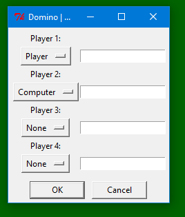
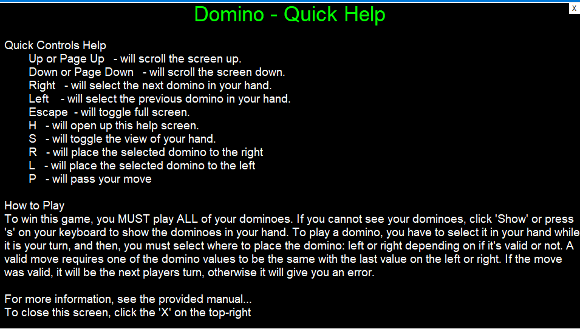
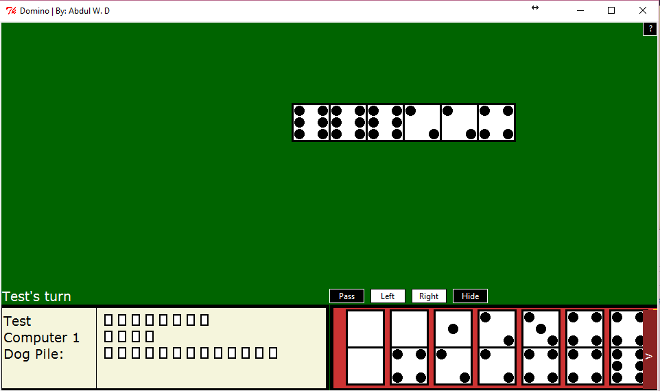

# Dominoes

Grade 11 project for Introduction to Computer Science (ICS).

# Getting Started

1. Install Python 2.7 (e.g., via chocolatey `choco install python2`)
2. Run domines.py: `C:\Python27\python.exe dominoes.py`
3. Enter number of users \
   
4. Review help screen \
   
5. Play! \
   
